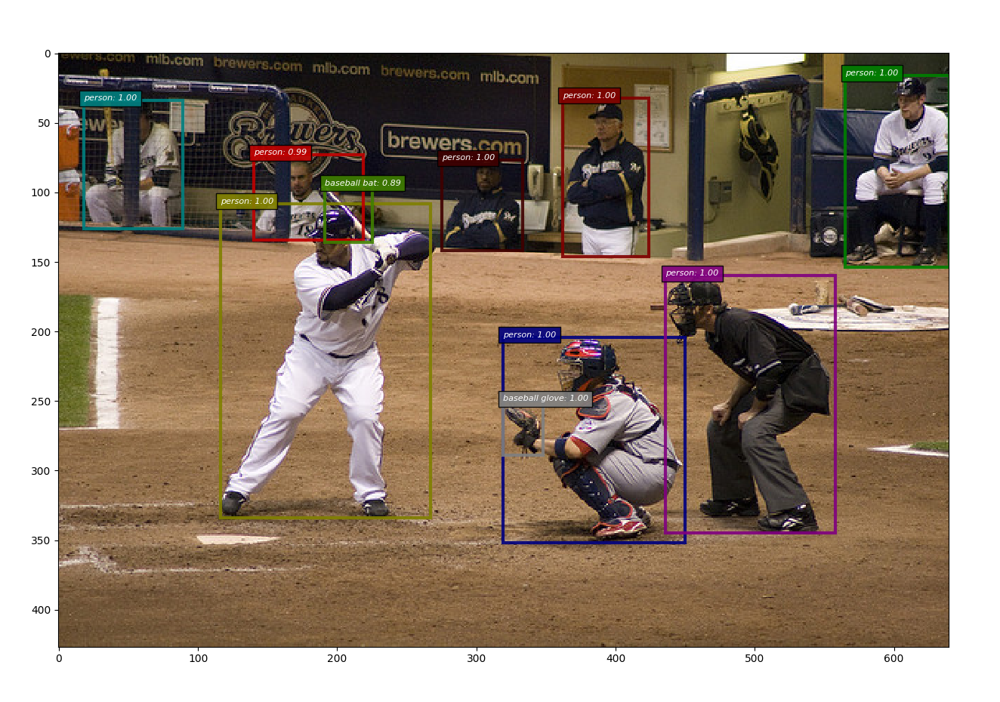

chainer-light-head-rcnn - Light Head RCNN
=========================================




This is [Chainer](https://github.com/chainer/chainer) implementation of [Light-Head R-CNN: In Defense of Two-Stage Object Detector](https://arxiv.org/abs/1711.07264).

Original TensorFlow repository is [zengarden/light_head_rcnn](https://github.com/zengarden/light_head_rcnn).

Requirement
-----------

- [CuPy](https://github.com/cupy/cupy)
- [Chainer](https://github.com/chainer/chainer)
- [ChainerCV](https://github.com/chainer/chainercv)
- OpenCV

Additional Requirement
----------------------
- For COCO Dataset class
  - [Cython](http://cython.org/)
  - [pycocotools](https://github.com/cocodataset/cocoapi)


Evaluation Score
----------------

| Implementation | mAP@0.5:0.95/all | mAP@0.5/all | mAP@0.75/all | mAP:0.5:0.95/small | mAP:0.5:0.95/medium | mAP:0.5:0.95/large |
|:--------------:|:----------------:|:-----------:|:------------:|:------------------:|:-------------------:|:------------------:|
| [Original](https://github.comzengarden/light_head_rcnn) | 0.400 | 0.621 | 0.429 | 0.225 | 0.446 | 0.540 |
| Ours | 0.391 | 0.607 | 0.419 | 0.212 | 0.428 | 0.541 |

Installation
------------

We recommend to use [Anacoda](https://anaconda.org/).

```bash
# Requirement installation
conda create -n light-head-rcnn python=3.6
source activate light-head-rcnn
pip install opencv-python
pip install cupy

# Installation
git clone https://github.com/knorth55/chainer-light-head-rcnn.git
cd chainer-light-head-rcnn/
pip install -e .
```

Inference
---------

```bash
cd examples/
python demo.py <imagepath> --gpu <gpu>
```

Training
--------

```bash
cd examples/
mpiexec -n <n_gpu> python train_multi.py
```

TODO
----
- COCO
  - [x] Add inference script.
  - [x] Add training script.
  - [x] Reproduce original accuracy.

LICENSE
-------
[MIT LICENSE](LICENSE)
